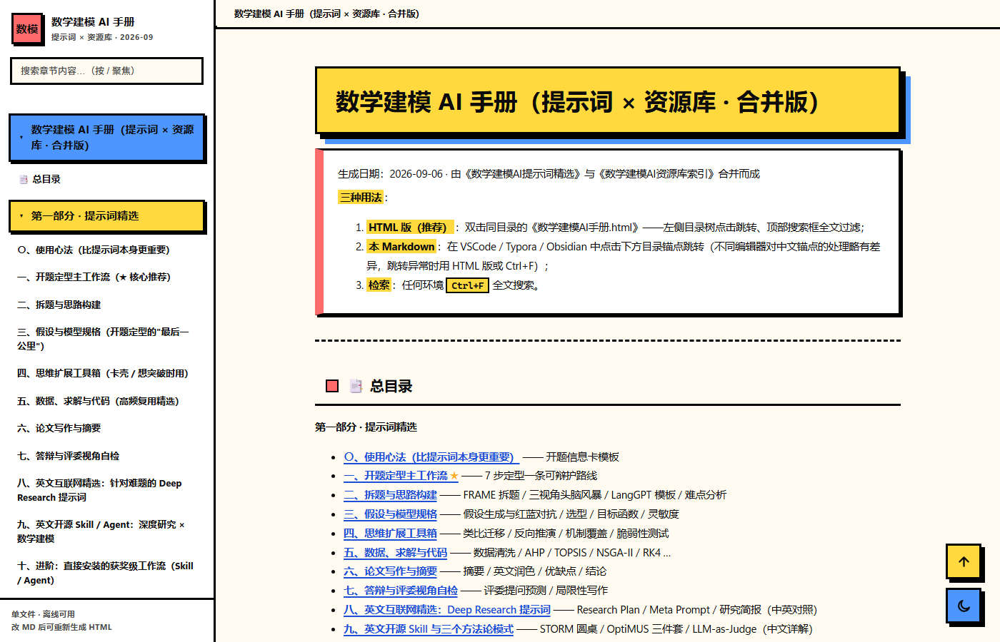
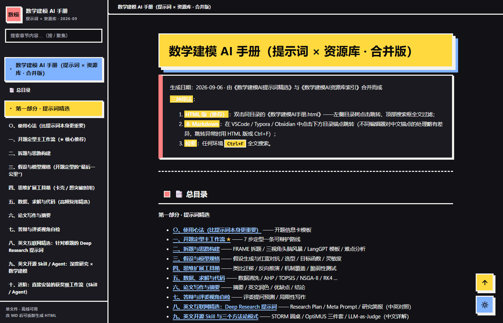

<div align="center">

# 数学建模 AI 手册

**提示词 × 资源库 · 单文件离线可用**

[](./数学建模AI手册.html)
[](#界面)
[](#重新生成-html)
[](#重新生成-html)
[](./LICENSE)

整理日期 2026-09-06 · 更新 2026-09-18

</div>

---

一份面向**全国大学生数学建模竞赛（CUMCM）/ 美赛（MCM/ICM）**的 AI 使用手册：把"怎么问 AI"沉淀成可复用的提示词，把散落全网的资源整理成可检索的索引。全部内容打包为**一个 HTML 文件**，双击即读，无需联网、无需安装任何东西。

## 界面





采用 **Neubrutalism（新粗野主义）** 视觉语言：3px 硬黑边框、`5px 5px 0` 硬投影、高饱和平色、零渐变零模糊、直角排版。亮/暗双主题，跟随系统偏好并可手动切换。

## 三种用法

1. **HTML（推荐）**
   双击 `数学建模AI手册.html`。左侧目录树点击跳转、顶部搜索框全文过滤（按 <kbd>/</kbd> 聚焦）、代码一键复制、亮暗主题切换、阅读进度条。单文件离线可用。
2. **Markdown**
   在 VSCode / Typora / Obsidian 中打开 `数学建模AI手册.md`。不同编辑器对中文锚点的处理略有差异，跳转异常时改用 HTML 版或 `Ctrl+F`。
3. **检索**
   任何环境直接 `Ctrl+F` 全文搜索。

## 文件说明

| 文件 | 用途 |
|---|---|
| `数学建模AI手册.html` | 成品：双击即读的单文件手册（含内嵌 MD 源与渲染引擎） |
| `数学建模AI手册.md` | **源文件**，要改内容改这份 |
| `build_manual_html.py` | 构建脚本：把 MD 渲染成 HTML，内嵌 CSS 与交互逻辑 |
| `marked.min.js` | Markdown 渲染引擎（v12.0.2，构建时读取并内嵌，仅构建期依赖） |
| `screenshots/` | README 预览图 |
| `LICENSE` | MIT 许可 |

## 内容结构

**第一部分 · 提示词精选**

| 章节 | 内容 |
|---|---|
| 〇 · 使用心法 | 开题信息卡模板——比提示词本身更重要的四条原则 |
| 一 · 开题定型主工作流 ★ | 7 步定型一条可辩护的建模路线 |
| 二 · 拆题与思路构建 | FRAME 拆题 / 三视角头脑风暴 / LangGPT 模板 / 难点分析 |
| 三 · 假设与模型规格 | 假设生成与红蓝对抗 / 选型 / 目标函数 / 灵敏度 |
| 四 · 思维扩展工具箱 | 类比迁移 / 反向推演 / 机制覆盖 / 脆弱性测试 |
| 五 · 数据、求解与代码 | 数据清洗 / AHP / TOPSIS / NSGA-II / RK4 … |
| 六 · 论文写作与摘要 | 摘要 / 英文润色 / 优缺点 / 结论 |
| 七 · 答辩与评委视角自检 | 评委提问预测 / 局限性写作 |
| 八 · 英文互联网精选 | Deep Research 提示词（Research Plan / Meta Prompt，中英对照） |
| 九 · 英文开源 Skill 与模式 | STORM 圆桌 / OptiMUS 三件套 / LLM-as-Judge（中文详解） |
| 十 · 进阶工作流 | mathodology 一键安装命令 + 三大工具对比 |

**第二部分 · 资源库索引**（R1–R11，75+ 条）：全流程 Agent 工作流 / 提示词库 / 学术论文与基准 / 深度研究专题 / 文献核验工具 / 数据来源 / LaTeX 模板与优秀论文 / 算法代码库与真题档案 / 学习路径 / 比赛规则与 AI 合规 / 按场景速查表。

**附录**：全部资源的出处与可信度依据。

## 重新生成 HTML

改动内容后，在本目录运行：

```bash
python build_manual_html.py
# OK  .../数学建模AI手册.html  (114 KB)
```

要求 Python 3（**仅标准库**，无第三方依赖、无网络请求）。脚本会读取同目录的 `数学建模AI手册.md` 与 `marked.min.js`，把 CSS、交互 JS、MD 源一并内嵌，产出可直接分发的单文件 HTML。

完整更新流程：

```bash
# 1. 编辑 数学建模AI手册.md
python build_manual_html.py          # 2. 重新生成 HTML
git add -A && git commit -m "更新手册" && git push   # 3. 提交
```

> Windows 下用 `python`；macOS / Linux 下若 `python` 指向 Python 2，请改用 `python3`。

## 交互与可访问性

- **目录树**：按 `h1`（部分）/ `h2` / `h3` 自动分组，滚动时高亮当前章节并同步顶部面包屑
- **全文搜索**：按 <kbd>/</kbd> 聚焦，实时过滤章节并高亮命中词，<kbd>Esc</kbd> 清空
- **代码块**：一键复制（含剪贴板 API 失败时的降级方案）
- **主题**：跟随 `prefers-color-scheme`，手动切换后写入 `localStorage`
- **可访问性**：正文对比度 ≥ 4.5:1（暗色链接 10.9:1）、全站可见焦点环、支持 `prefers-reduced-motion`、图标为内联 SVG 而非 emoji、打印样式已适配

## 许可与致谢

本仓库采用 **[MIT License](./LICENSE)**。

- **自有内容**：手册正文（提示词文本、方法论整理）、`build_manual_html.py` 构建脚本、页面样式与交互逻辑，均可自由使用、修改、分发，**包括商业用途**，只需保留版权声明。无需另行署名或申请授权。
- **第三方资源**：所收录的项目、论文、模板、数据源版权归各自作者所有，**其许可条款以原始站点为准**。本仓库仅提供索引与外链，未重新分发这些资源的正文；使用前请自行确认对应条款。
- **免责**：内容整理自公开网络资源，AI 生成内容存在幻觉风险，**关键数据、引用与公式请务必自行交叉核验**。

致谢：[marked](https://github.com/markedjs/marked)（MIT）提供 Markdown 渲染；界面视觉规范参考 [ui-ux-pro-max](https://github.com/nextlevelbuilder/ui-ux-pro-max-skill)（MIT）的 Neubrutalism 风格条目。

---

<div align="center">

如果这份手册对你有帮助，欢迎 Star ⭐

</div>
